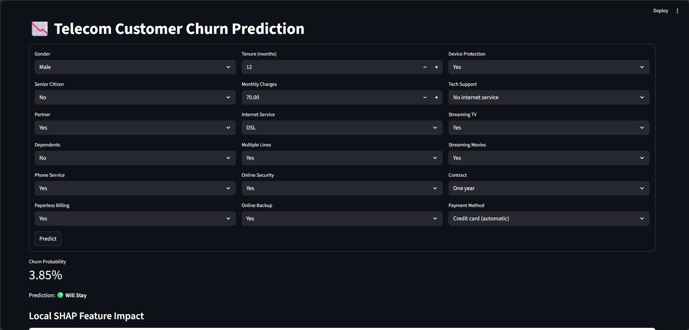
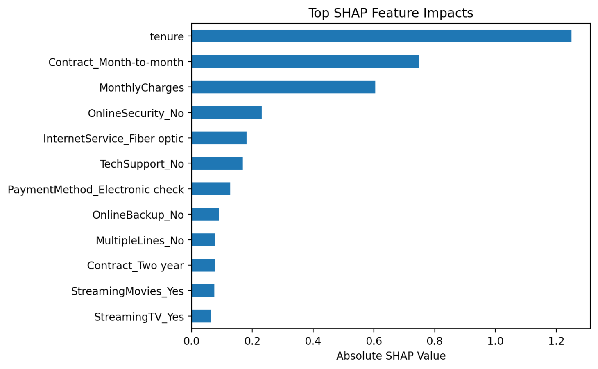
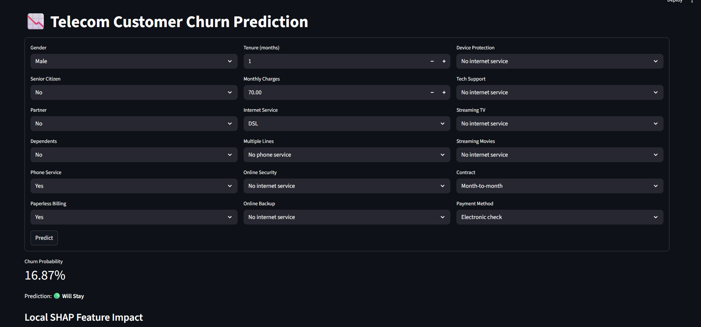
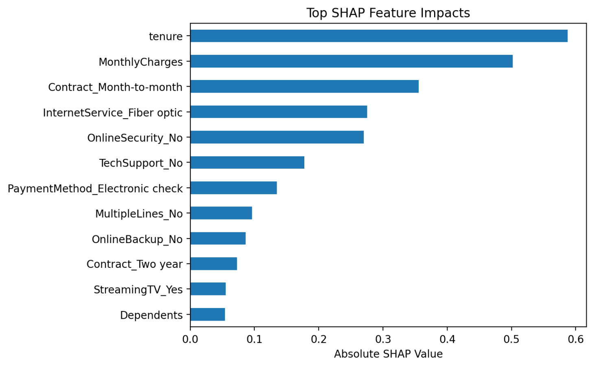

🚀 Customer Churn Prediction – ML Web App

An end-to-end Machine Learning project that predicts the likelihood of customer churn for a telecom service provider and provides actionable insights through an interactive web application.

📌 Problem Statement

Customer churn is a major challenge for telecom companies, directly impacting revenue and growth.
This project aims to predict whether a customer is likely to leave and help businesses take proactive retention measures.

🎯 Key Features
🔍 Churn Prediction – Predicts the probability of a customer leaving (0–100%)
📊 Binary Classification Output – Stay or Leave decision
🧠 Model Explainability – Insights powered by SHAP values
🌐 Interactive Web App – Real-time predictions using Streamlit
⚙️ Robust ML Pipeline – Handles preprocessing, feature engineering, and model inference seamlessly
🛠️ Tech Stack
Languages: Python
Libraries: Scikit-learn, XGBoost, Pandas, NumPy
Explainability: SHAP
Frontend/UI: Streamlit
Deployment: Streamlit App
⚙️ Machine Learning Workflow
1. Data Preprocessing
Handled missing values
Encoded categorical variables
Scaled numerical features
2. Feature Engineering
Transformed raw telecom data into meaningful features
Improved model performance through feature selection
3. Model Training & Evaluation

Trained and compared multiple models:

Logistic Regression
Random Forest
XGBoost

Selected the best-performing model based on evaluation metrics.

4. Model Explainability
Used SHAP to interpret predictions
Provided feature-level impact on churn decisions
🌐 Web Application

The Streamlit app enables users to:

Input customer details (tenure, services, billing, etc.)
Get instant churn probability
View prediction result (Stay / Leave)
Understand key factors influencing the prediction
📸 Demo

(Add screenshots or GIFs of your app here — this is non-negotiable if you want to impress recruiters)

🚀 How to Run Locally
# Clone the repository
git clone https://github.com/Parveez19/Customer-Churn-Prediction

# Navigate to project directory
cd customer-churn-prediction

# Install dependencies
pip install -r requirements.txt

# Run the app
streamlit run app.py

📊 Results & Insights
Achieved strong performance across multiple models
XGBoost provided the best balance of accuracy and generalization
SHAP analysis revealed key drivers of churn such as:
Contract type
Monthly charges
Tenure